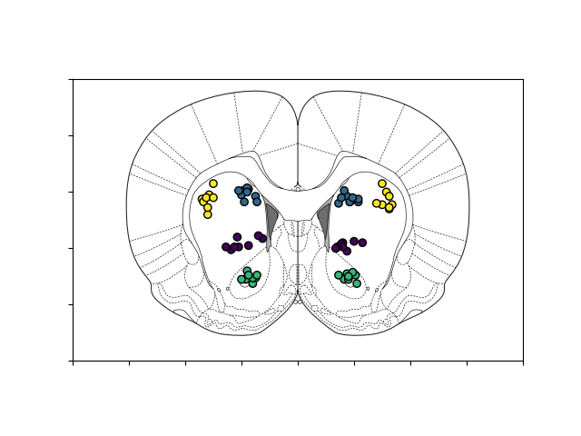

# plot_svg

 
`plot_svg` leverages the robust `svgelements` library to natively display SVG Shape objects in `matplotlib` as patches.
This functionality is highly useful for a variety of data visualization applications where datasets must be plotted over
existing to-scale vector graphics files.

## Why `plot_svg`?

Existing solutions to this problem, like [`skunk`](https://github.com/whitead/skunk) handle this task by montaging the 
`matplotlib` vector graphics onto a separate instance of the SVG file. While this is useful in many cases, there will be 
artifacts and mismatches between the `matplotlib` and SVG portions of the plot since they will be generated and handled b
by separate rendering systems. `matplotlib` has an [example](https://matplotlib.org/stable/gallery/showcase/firefox.html#sphx-glr-gallery-showcase-firefox-py)
of parsing a simple SVG to display natively but this only works for the most basic SVG Paths. `plot_svg` extends this concept
to support the full set of SVG Shapes along with many of their attributes. 

## License

This module is under a MIT License. https://github.com/theonlydvr/plot_svg/blob/main/LICENSE

## Installing

## Requirements

`svgelements` for robustly parsing SVG files

`matplotlib` for making the plots

## Examples

A number of examples are available in the *tests* directory.

## Features Supported

`plot_svg` supports all SVG Shapes to the degree they are handled by `svgelements`. Currently, all non Shape elements
(like Text) are ignored by `plot_svg`. 